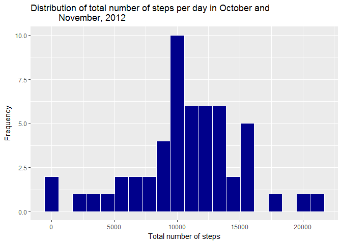

# Course Project 1 - Reproducible Research
Jorik Schra  
24 May 2017  

## Introduction

In this report, data analyses and plots will be presented for the first course project of the course Reproducible Research, along with the code required to produce them. To do so, data is used from a personal activity monitoring device.The data consists of two months of data from an anonymous individual collected during the months of October and November, 2012 and include the number of steps taken in 5 minute intervals each day.

## The data

Before proceeding, the data must first be downloaded and read into R, which can be done as follows:


```r
# Load required libraries
library(dplyr)
library(ggplot2)


# Set working directory
setwd("D:/R Directories/Coursera/Reproducible Research/Course Project 1")

# Download file, read in data and delete zip
if (!file.exists("activity.csv")) {
      fileUrl <- "https://d396qusza40orc.cloudfront.net/repdata%2Fdata%2Factivity.zip"
      download.file(fileUrl, "activity_data.zip")
      unzip("activity_data.zip")
      df <- read.csv("activity.csv")
      invisible(file.remove("activity_data.zip"))
      invisible(rm(fileUrl))
      } else {
      df <- read.csv("activity.csv") 
}
```

## Mean total number of steps taken per day

For the first assignment, the total amount of steps per day must be calculated. To do so, the Dplyr package is used to group the data by the variable `date`, after which the total number of steps per date can be calculated as follows:


```r
df <- group_by(df, date)
df_s <- summarize(df, Steps=sum(steps))
head(df_s)
```

```
## # A tibble: 6 × 2
##         date Steps
##       <fctr> <int>
## 1 2012-10-01    NA
## 2 2012-10-02   126
## 3 2012-10-03 11352
## 4 2012-10-04 12116
## 5 2012-10-05 13294
## 6 2012-10-06 15420
```

Next, the assignment requires you to plot a histogram with the total number of steps taken each day. This can be done as follows, using the ggplot2 package:


```r
g <- ggplot(df_s, aes(x=Steps))
g +
      geom_histogram(bins=20, fill="Darkblue", color="White") +
      labs(x="Total number of steps", y="Frequency", 
           title="Distribution of total number of steps per day in October and
           November, 2012")
```

```
## Warning: Removed 8 rows containing non-finite values (stat_bin).
```

<!-- -->

Lastly, the mean and median number of steps taken per day are requested:


```r
mean(df_s$Steps, na.rm=TRUE)
```

```
## [1] 10766.19
```

```r
median(df_s$Steps, na.rm=TRUE)
```

```
## [1] 10765
```

## The average daily activity pattern

Apart from summing the amount of steps per day, the average step pattern per day may also be interesting to analyse. To do so, the `group_by()` function is used again to group the data, but this time on 5-minute intervals using the `interval` variable.

Next, a time series plot is generated of the 5-minute interval and the average number of steps taken, averaged across all days in the dataset:


```r
df <- group_by(df, interval)
df_s <- summarise(df, average_steps=mean(steps, na.rm=TRUE))

g <- ggplot(df_s, aes(x=interval, y=average_steps))
g +
      geom_line(color="Darkblue") +
      scale_x_continuous(breaks=pretty(df_s$interval, n=20)) +
      theme(axis.text.x=element_text(angle=45, hjust=1)) +
      labs(x="Five minute interval (ticks are set per hour)", y="Average number of steps taken", 
           title="Average daily pattern of steps taken per interval")
```

<!-- -->

Clearly, a peak can be observed in the time series plot. To find out which 5-minute interval contains the maximum number of steps on average, the follow code can be used:


```r
max_steps <- max(df_s$average_steps)
df_s$interval[df_s$average_steps==max_steps]
```

```
## [1] 835
```

Accordingly, the maximum number of steps are made on average in between 08:35 and 08:40.

## Imputing missing values

There are several numbers of days/intervals for which the data on steps is missing (which are coded as **NA**). Specifically, the total of missing values is equal to:


```r
nrow(df[is.na(df),])
```

```
## [1] 2304
```

As these missing values can introduce bias into the data, a strategy is required to fill these values. I have chosen to use the means of the intervals to fill the missing values of the intervals. To do so, the mean per interval is calculated using Dplyr and the `mean()` function, after which a vector is created which contains the average per interval, which are repeated over the length of the `interval` variable of the data.


```r
df <- group_by(df, interval)
df_s <- summarise(df, steps=mean(steps, na.rm=T))
avg <- as.vector(rep(df_s$steps, times=length(df$interval)/length(df_s$interval)))
```

In order to create a new dataset in which the missing values are replaced by the averages, first the rows which contain the missing values must be computed. Using these indexes, the missing values in the data can be filled with the averages from the `avg` vector, of which the indexes match the indexes of the data frame. The following code can be used to create the new data frame:


```r
mv <- is.na(df$steps)
df_n <- df
df_n[mv, 1] <- avg[mv]
```

To check if the newly created data frame no longer contains any missing values, the following code can be used:


```r
sum(is.na(df_n))
```

```
## [1] 0
```

Using the newly created data set, we again plot a histogram with the total number of steps taken each day, and calculate the mean and median total number of steps taken per day, to see if the plot and values differ from the previously calculated ones.


```r
# Histogram of total steps per day
df_n <- group_by(df_n, date)
df_s <- summarize(df_n, Steps=sum(steps))

g <- ggplot(df_s, aes(x=Steps))
g +
      geom_histogram(bins=20, fill="Darkblue", color="White") +
      labs(x="Total number of steps", y="Frequency", 
           title="Distribution of total number of steps per day in October and
           November, 2012")
```

<!-- -->

```r
# Calculate the mean of the number of steps taken per day
mean(df_s$Steps, na.rm=TRUE)
```

```
## [1] 10766.19
```

```r
#Calculate the median of the number of steps taken per day
median(df_s$Steps, na.rm=TRUE)
```

```
## [1] 10766.19
```

As can be seen from the output, the plot has changed quite substantially, which is natural as there were a total of 2304 missing values present in the original data frame. Furthermore, the mean and median have now become the same, whereas these differed for the original data frame. 

## Differences in activity patterns between weekdays and weekends

Previously, we observed the average daily activity pattern. It might be interesting, however, to see if this patterns differs between weekdays and weekends.

Accordingly, the data must be grouped as weekday or weekend. To do so, a new column is added which indicates whether an observation was made during a weekday or the weekend. Using Dplyr, the `weekdays()` function and the `gsub()` function, this can be done as follows:


```r
df_n <- ungroup(df_n)
Sys.setlocale("LC_TIME", "English")
```

```
## [1] "English_United States.1252"
```

```r
df_n <- mutate(df_n, Weekday=weekdays(as.Date(df_n$date)))
df_n$Weekday <- gsub("Monday|Tuesday|Wednesday|Thursday|Friday", "weekday", 
                     df_n$Weekday)
df_n$Weekday <- gsub("Saturday|Sunday", "weekend", 
                     df_n$Weekday)
```

Note that `Sys.setlocale("LC_TIME", "English")` is used to ensure that the output of the `weekdays()` function is in English.

By using the newly created categorical variable, the average daily activity pattern is plotted for weekdays and the weekend. Note that the same code is used as before, with only a few additions.


```r
df_n <- group_by(df_n, interval, Weekday)
df_s <- summarise(df_n, average_steps=mean(steps, na.rm=TRUE))

g <- ggplot(df_s, aes(x=interval, y=average_steps))
g +
      geom_line(color="Darkblue") +
      scale_x_continuous(breaks=pretty(df_s$interval, n=10)) +
      theme(axis.text.x=element_text(angle=45, hjust=1)) +
      facet_grid(.~Weekday) +
      labs(x="Five minute interval (ticks are set per 2 hours)", 
           y="Average number of steps taken", 
           title="Average pattern of steps taken per interval during weekdays and the weekend")
```

<!-- -->

And this concludes the report for the assignment! If you've read it all the way through to this point, **thank you for your time!**
